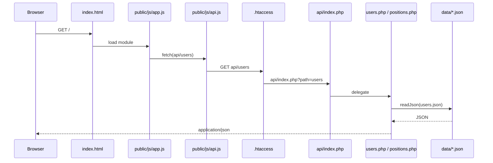

# Architecture

This document describes how the prototype is built, how requests flow through the stack, and how the repository is organized. For product vision, milestones, and feature specifications, see [README.md](README.md).

**Last reviewed:** 2026-06-14 (update this date when you change API routes, data shapes, or deployment assumptions.)

---

## Runtime overview

On a typical visit:

1. The browser loads **`index.html`** from the app root (same origin as the API).
2. **`public/js/app.js`** runs as an ES module: it wires **hash-based routing** (`#/feed`, `#/profile`), the **user switcher**, and delegates rendering to feature modules.
3. Feature modules (**`feed.js`**, **`profile.js`**) call **`api.js`**, which uses **`fetch`** against relative URLs under `api/…` (resolved against the current page URL, so subdirectory installs work without extra config).
4. Apache applies **`.htaccess`** rewrite rules so `api/<path>` is handled by **`api/index.php?path=<path>`**, which routes to **`users.php`** or **`positions.php`**.
5. Handlers use **`api/config.php`** helpers to read/write JSON under **`data/`**.



---

## Technical stack

| Layer | Choice | Notes |
| --- | --- | --- |
| Front-end | Vanilla JavaScript (ES modules) | No bundler; hash routing in `app.js`. JSDoc on public scripts; shared API shapes for `tsc --checkJs` in `public/js/types.d.ts` (see `public/js/jsconfig.json`). |
| Back-end | Vanilla PHP | Small router in `api/index.php`; per-resource scripts. |
| HTTP server | Apache (e.g. XAMPP) | `RewriteEngine` required for API paths (see Deployment). |
| Data (prototype) | JSON files under `data/` | Planned migration to SQL for later milestones. |
| Type-checking | Optional `tsc` | See [AGENTS.md](AGENTS.md) for the check command used in this repo. |

---

## Front-end structure

| Path | Role |
| --- | --- |
| `index.html` | Shell: header, nav, `#app` mount, loads `public/js/app.js`. |
| `public/css/style.css` | Global styles. |
| `public/js/app.js` | Bootstrap: routes `#/feed` and `#/profile`, listens for `hashchange` and `userchanged`. |
| `public/js/api.js` | Thin REST client; `API_BASE = 'api'`. |
| `public/js/feed.js` | Feed UI and position/comment flows. |
| `public/js/profile.js` | Profile UI. |
| `public/js/user-switcher.js` | Development-only user selection; persists choice (e.g. `localStorage`) for API calls. |
| `public/js/jsconfig.json` | Enables `tsc` / editor checking of plain JS (`allowJs`, `checkJs`). |
| `public/js/types.d.ts` | Declares shared domain types (`User`, `Position`, `Comment`, …) for the checker only; not loaded at runtime. |

There is no client-side framework: new pages are new modules plus a branch in `app.js` `render()`.

---

## HTTP API

All responses are JSON with `Content-Type: application/json`. Errors use `{ "error": "message" }` where applicable. **`api/config.php`** sets **CORS** to `Access-Control-Allow-Origin: *` and handles **OPTIONS** preflight in **`api/index.php`**.

Logical paths (after rewrite) map as follows. Implementation files are the source of truth if this table drifts.

| Method | Path | Description | Handler |
| --- | --- | --- | --- |
| `GET` | `/api/users` | List all users. | `api/users.php` |
| `GET` | `/api/users/{id}` | Single user by integer `id`. | `api/users.php` |
| `GET` | `/api/positions` | List positions (newest `createdAt` first). | `api/positions.php` |
| `POST` | `/api/positions` | Create position. Body: `title`, `description`, `authorId`. | `api/positions.php` |
| `GET` | `/api/positions/{id}/comments` | Comments for a position. | `api/positions.php` |
| `POST` | `/api/positions/{id}/comments` | Add comment. Body: `content`, `authorId`. | `api/positions.php` |

Other methods on these resources return **405**; unknown paths return **404** from `api/index.php`.

---

## Data model (JSON prototype)

Files live in **`data/`** and are read/written as JSON arrays of objects.

| File | Entity | Key fields (conceptual) |
| --- | --- | --- |
| `users.json` | User | `id` (int), `name`, `bio` |
| `positions.json` | Volunteering position | `id` (int), `authorId` (user id), `title`, `description`, `createdAt` (ISO 8601) |
| `comments.json` | Comment on a position | `id` (int), `positionId`, `authorId`, `content`, `createdAt` |

**ID policy:** New rows get `max(existing id) + 1`. When moving to SQL, preserve integer IDs or introduce a stable migration mapping if IDs change.

**Relations:** `authorId` and `positionId` reference `users.id` and `positions.id` respectively; the prototype does not enforce referential integrity in the database layer.

---

## Security and authentication (prototype)

- There is **no register/login** in early milestones; users are **pre-seeded** in `users.json`.
- The **user switcher** is a **development tool** only: the client sends `authorId` on writes. The API does **not** verify that the caller “is” that user.
- **CORS is open** (`*`), which is acceptable for local prototyping but must be tightened for production.
- There is **no CSRF token**, session cookie, or rate limiting in the current API.

Treat any machine that can reach the API as able to post as any `authorId` until real auth exists.

---

## Deployment and base URL

- The app can be served from a **subdirectory** (e.g. `http://localhost/git/open-volunteering/`) because the front-end uses **relative** `api/...` URLs and assets under `public/`.
- **`.htaccess`** at the repository root must be active (`AllowOverride All` in Apache) so requests reach **`api/index.php`**:

  ```apache
  RewriteRule ^api/(.*)$ api/index.php?path=$1 [QSA,L]
  ```

- If rewrites are disabled, `/api/users` will not reach the router; you will see 404 or directory listing depending on server config.

---

## Repository layout (remainder)

```
├── index.html       # App entry point
├── .htaccess        # Rewrites /api/* to api/index.php
├── public/          # Front-end assets
│   ├── css/
│   └── js/          # ES modules + jsconfig/types.d.ts for optional tsc
├── api/             # PHP REST API (router + handlers + config)
├── data/            # JSON storage (users, positions, comments)
└── ui_prototypes/   # Design references (not loaded by the live app)
```

---

## Future architecture (north star)

Aligned with [README.md](README.md):

- **Today:** single PHP app, single JSON-backed store, one deployment unit.
- **Later:** registered users, organizations, richer feeds—likely **SQL** and authenticated sessions or tokens.
- **Long term:** **decentralized / Fediverse (ActivityPub)**—multiple deployable instances (e.g. per organization), federation between servers. That implies stable globally unique actor identifiers, inbox/outbox semantics, and security models beyond this prototype.

This file should gain a short “Federation notes” subsection when the first ActivityPub-related code or config lands.

---

## Documentation scope

| Document | Purpose |
| --- | --- |
| **README.md** | What we are building, milestones, UX/feature specs, use cases. |
| **ARCHITECTURE.md** (this file) | Stack, folders, request flow, API, data on disk, deployment, security posture of the prototype. |

When you add a route, JSON field, or new `public/js` module, update the relevant section here in the same change when practical.
