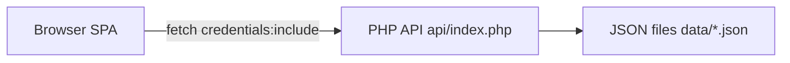
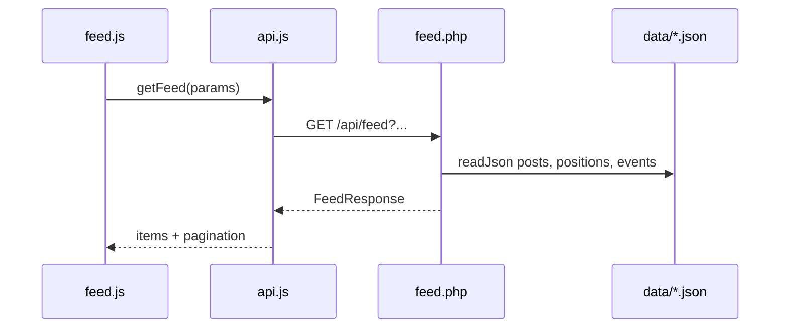
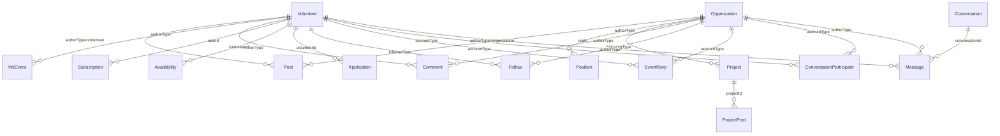

# Architecture

Technical overview of how Open Volunteering is built. For product features and specifications, see [README.md](README.md). For development and testing conventions, see [AGENTS.md](AGENTS.md).

## 1. Overview

Open Volunteering is a prototype social network for volunteers and volunteer organizations. It is a **vanilla JavaScript hash-routed SPA** that talks to a **PHP REST API** backed by **JSON file storage**, hosted on **XAMPP/Apache**.


```mermaid
flowchart LR
  Browser["Browser SPA"] -->|"fetch credentials:include"| API["PHP API api/index.php"]
  API --> Data["JSON files data/*.json"]
```

**Stack highlights:**

| Layer | Technology |
|-------|------------|
| Frontend | ES modules, hash routing, no build step |
| Backend | PHP 8+, one handler file per resource |
| Storage | JSON files in `data/` |
| Hosting | XAMPP (Apache + PHP), `mod_rewrite` |
| Map | Leaflet 1.9 (CDN, map page only) |
| Types | JSDoc + `types.d.ts`, checked via `npx tsc -p public/js/jsconfig.json --noEmit` |

## 2. Repository layout

| Path | Role |
|------|------|
| [index.html](index.html) | App shell: header, nav, `#app` mount point |
| [public/css/style.css](public/css/style.css) | Mobile-first styles |
| [public/js/app.js](public/js/app.js) | Hash router and page dispatch |
| [public/js/api.js](public/js/api.js) | Typed fetch client (`credentials: 'include'`) |
| [public/js/auth.js](public/js/auth.js) | Session cache and auth UI |
| [public/js/feed.js](public/js/feed.js) | Feed page |
| [public/js/positions.js](public/js/positions.js) | Positions page |
| [public/js/calendar.js](public/js/calendar.js) | Calendar page |
| [public/js/map.js](public/js/map.js) | Map page (Leaflet) |
| [public/js/profile.js](public/js/profile.js) | Profile page |
| [public/js/components/](public/js/components/) | Shared UI (post-card, comments, pagination, feed-controls) |
| [public/js/types.d.ts](public/js/types.d.ts) | Domain type definitions (canonical schema) |
| [api/index.php](api/index.php) | Central API router |
| [api/config.php](api/config.php) | Shared helpers: JSON I/O, auth, geo |
| [api/*.php](api/) | One handler per REST resource |
| [data/*.json](data/) | One file per entity collection |
| [.htaccess](.htaccess) | Rewrites `/api/*` to `api/index.php?path=...` |

## 3. Request lifecycle

Three routing layers connect the browser to persisted data.

### Apache rewrite

[`.htaccess`](.htaccess) forwards all API traffic to the PHP front controller:

```
/api/feed  →  api/index.php?path=feed
```

### PHP router

[`api/index.php`](api/index.php) splits `$_GET['path']` on `/` and maps the first segment to a handler:

| Segment | Handler |
|---------|---------|
| `auth` | `auth.php` |
| `users` | `users.php` |
| `posts` | `posts.php` |
| `positions` | `positions.php` |
| `events` | `events.php` |
| `comments` | `comments.php` |
| `feed` | `feed.php` |
| `projects` | `projects.php` |
| `subscriptions` | `subscriptions.php` |
| `availability` | `availability.php` |
| `map` | `map.php` |
| `files` | `files.php` |
| `conversations` | `conversations.php` |
| `notifications` | `notifications.php` |

Each handler reads further path segments via `getPathSegments()` and dispatches on HTTP method.

### Frontend router

[`public/js/app.js`](public/js/app.js) parses `window.location.hash` and calls the matching page renderer on `hashchange`. Default route: `#/feed`.

### Example: loading the feed


```mermaid
sequenceDiagram
  participant Page as feed.js
  participant API as api.js
  participant PHP as feed.php
  participant JSON as data/*.json
  Page->>API: getFeed(params)
  API->>PHP: GET /api/feed?...
  PHP->>JSON: readJson posts, positions, events
  PHP-->>API: FeedResponse
  API-->>Page: items + pagination
```

## 4. Authentication and sessions

Authentication uses **PHP server-side sessions** with cookie-based identity. Only **users** (people accounts in `users.json`) can log in. Organizations are not login accounts; they are managed through **memberships** in `organization_members.json`.

### Users vs volunteers

A **user** is anyone with a personal account. Not every user is seeking volunteer work — org staff may use the platform without volunteering. Optional profile fields `seekingVolunteering` and `weeklyVolunteeringHours` express volunteering availability.

### Server

- [`api/config.php`](api/config.php) starts the session and exposes `getSessionUserId()`, `getActiveAccount()`, `requireAuth()`, `requireOrgAdminSession()`, and `publicUser()`.
- On register or login, [`api/auth.php`](api/auth.php) sets `$_SESSION['userId']` and active context (`activeAccountType` / `activeAccountId`).
- `POST /api/auth/switch` lets an org **admin** switch active context to an organization they administer.
- `requireAuth()` returns HTTP 401 when no session exists.
- `publicUser()` strips `passwordHash` and adds `type: "user"`.

### Session fields

| Field | Meaning |
|-------|---------|
| `userId` | Logged-in user (always set after login) |
| `activeAccountType` | Acting context: `user` or `organization` |
| `activeAccountId` | ID in the active context |

Stored JSON records (conversation participants, RSVPs, etc.) use `accountType` / `accountId` as permanent references — not the session “active” prefix.

### Client

- [`public/js/api.js`](public/js/api.js) sends `credentials: 'include'` on every request.
- [`public/js/auth.js`](public/js/auth.js) caches `GET /api/auth/me` as `MeResponse` (includes `userId`, `memberships`, `activeAccountType`, `activeAccountId`) and renders a header **account switcher** for admins.

### Auth endpoints

| Method | Path | Auth | Description |
|--------|------|------|-------------|
| POST | `/api/auth/register` | No | Register user. Body: `name`. Server generates password once as `generatedPassword`. |
| POST | `/api/auth/login` | No | Login. Body: `name`, `password` |
| POST | `/api/auth/logout` | No | Destroy session |
| GET | `/api/auth/me` | Yes | Session context + active account profile |
| POST | `/api/auth/switch` | Yes | Body: `activeAccountType`, `activeAccountId?` |

### Prototype gaps

Not yet implemented (see README "Non-prototype todo"): CSRF tokens, rate limiting, email verification, password reset.

## 5. Data model

### Entity relationships

All entities relate via integer IDs. **Users** and **organizations** use separate ID namespaces in `users.json` and `organizations.json`. Organization **memberships** (`organization_members.json`) link users to orgs with role `admin` or `member`. Cross-references use polymorphic `accountType` + `accountId` (or `authorType` + `authorId` on content).

- **Posts, positions, events** use `authorType` (`user` \| `organization`) + `authorId`.
- **Session** stores `userId` plus active context `activeAccountType` / `activeAccountId`.
- **Applications** use `userId` (user must have `seekingVolunteering: true` to apply).


```mermaid
erDiagram
  Volunteer ||--o{ Post : "authorType=volunteer"
  Organization ||--o{ Post : "authorType=organization"
  Volunteer ||--o{ VolEvent : authorType
  Organization ||--o{ Position : authorType
  Organization ||--o{ Project : orgId
  Volunteer ||--o{ Comment : authorType
  Organization ||--o{ Comment : authorType
  Volunteer ||--o{ Subscription : userId
  Volunteer ||--o{ Availability : volunteerId
  Volunteer ||--o{ Application : volunteerId
  Volunteer ||--o{ Follow : followerType
  Organization ||--o{ Follow : followingType
  Volunteer ||--o{ EventRsvp : accountType
  Organization ||--o{ EventRsvp : accountType
  Volunteer ||--o{ ConversationParticipant : accountType
  Organization ||--o{ ConversationParticipant : accountType
  Conversation ||--o{ Message : conversationId
  Volunteer ||--o{ Message : authorType
  Organization ||--o{ Message : authorType
  Project ||--o{ ProjectPost : projectId
```

- **Posts, positions, events** use `authorType` (`volunteer` \| `organization`) + `authorId`.
- **Comments** use polymorphic `targetType` (`post` \| `position` \| `event`) + `targetId`, and `authorType` + `authorId`.
- **Projects** belong to an organization via `orgId`.
- **Follows** use `followerType`/`followerId` and `followingType`/`followingId`.
- **Messaging** participants use `accountType` + `accountId`; messages use `authorType` + `authorId`.
- **Session** stores `accountType` + `accountId` (not a single shared user id).

### Entity → file → API

| Entity | File | API handler |
|--------|------|-------------|
| Users | `users.json` | `auth.php`, `users.php` |
| Organization members | `organization_members.json` | `organizations.php` |
| Organizations | `organizations.json` | `organizations.php` |
| Posts | `content/posts.json` | `posts.php` |
| Positions | `content/positions.json` | `positions.php` |
| Events | `content/events.json` | `events.php` |
| Comments | `content/comments.json` | `comments.php` |
| Projects | `content/projects.json` | `projects.php` |
| Project posts | `content/project_posts.json` | `projects.php` |
| Follows | `social/follows.json` | `users.php`, `organizations.php` |
| Applications | `social/applications.json` | `positions.php` |
| Event RSVPs | `social/event_rsvps.json` | `events.php` |
| Subscriptions | `social/subscriptions.json` | `subscriptions.php` |
| Availability | `social/availability.json` | `availability.php` |
| Notifications | `social/notifications.json` | `notifications.php` |
| Conversations | `messaging/conversations.json` | `conversations.php` |
| Conversation participants | `messaging/conversation_participants.json` | `conversations.php` |
| Messages | `messaging/messages.json` | `conversations.php` |
| Stored files | `files.json` + `data/uploads/*` | `files.php` |

Map markers are computed at request time in `map.php` (not stored separately).

**File storage:** Image blobs live under `data/uploads/` (not web-accessible; `data/.htaccess` denies direct HTTP). Metadata is in `files.json` (usage-agnostic catalog). Parent records reference files by id: `Post.imageFileId`, volunteer `User.avatarFileId`, `Organization.avatarFileId`. Files use `ownerType` + `ownerId`. When attached, the file record gets `attachedTo: { type, id }` (`user`, `organization`, or `post`).

### Schema reference

Canonical field definitions live in [`public/js/types.d.ts`](public/js/types.d.ts). Example shapes:

```typescript
// User (users.json)
{ id, email, name, bio?, location?, skills?, experience?, seekingVolunteering?, weeklyVolunteeringHours?, avatarFileId?, createdAt? }

// Organization (organizations.json) — no login credentials
{ id, name, bio?, location?, createdByUserId?, avatarFileId?, createdAt? }

// Organization member
{ id, organizationId, userId, role: "admin"|"member", joinedAt }

// Post
{ id, authorType, authorId, postType, content, likeCount, shareCount, imageFileId?, createdAt }

// StoredFile (files.json)
{ id, ownerType, ownerId, originalName, storedName, mimeType, byteSize, width, height, createdAt, attachedTo? }

// Position / Event
{ id, authorType, authorId, title, description, ... }
```

Records not yet fully defined in `types.d.ts`:

| Entity | Fields |
|--------|--------|
| Follow | `followerType`, `followerId`, `followingType`, `followingId`, `createdAt` |
| Application | `id`, `positionId`, `userId`, `status`, `createdAt` |
| Event RSVP | `eventId`, `accountType`, `accountId`, `status` (`going` \| `maybe`) |
| Project post | `id`, `projectId`, `content`, `createdAt` |
| Conversation participant | `conversationId`, `accountType`, `accountId`, `joinedAt`, `role`, `lastReadAt?` |

API-only computed types: `FeedItem`, `FeedResponse`, `MapMarker`, `ProjectDetailResponse`.

### Persistence patterns

From [`api/config.php`](api/config.php):

- Each JSON file is a **top-level array** of records.
- IDs are assigned by `nextId()` (max existing `id` + 1).
- Reads and writes are **whole-file** (`readJson` / `writeJson`); there are no transactions or referential integrity checks.
- `GeoLocation` is `{ label, lat, lng }`; distance sorting uses `haversineKm()`.
- Uploaded images: max 2 MB; JPEG/PNG/WebP only; validated with `finfo` + `getimagesize`.

## 6. API reference

All responses are JSON. Errors use `{ "error": "message" }` with an appropriate HTTP status code via `jsonResponse()`.

**Auth pattern:**

- GET list/detail endpoints are **public** (no login required).
- POST, PATCH, DELETE mutations require a **valid session**.
- **Role checks:** org admins (in active org context) create positions/projects and manage members; users with `seekingVolunteering` apply to positions; users PATCH only their own profile.

**CORS:** `OPTIONS` returns 204; `Access-Control-Allow-Origin: *` on all responses (prototype setting).

### auth — `/api/auth/{action}`

| Method | Path | Auth | Notes |
|--------|------|------|-------|
| POST | `/api/auth/register` | No | Body: `name`. Response includes one-time `generatedPassword`. |
| POST | `/api/auth/login` | No | Body: `name`, `password` |
| POST | `/api/auth/logout` | No | Clears session |
| GET | `/api/auth/me` | Yes | Session + active account |
| POST | `/api/auth/switch` | Yes | Switch user/org context |

### users — `/api/users[/{id}[/{sub}]]`

| Method | Path | Auth | Notes |
|--------|------|------|-------|
| GET | `/api/users` | No | List all users |
| GET | `/api/users/me/memberships` | Yes | Org memberships for logged-in user |
| GET | `/api/users/{id}` | No | Single user |
| PATCH | `/api/users/{id}` | Yes (own profile) | Includes `seekingVolunteering`, `weeklyVolunteeringHours` |
| POST | `/api/users/{id}/follow` | Yes | Follow user |
| DELETE | `/api/users/{id}/follow` | Yes | Unfollow user |
| GET | `/api/users/{id}/feed` | No | User profile feed (delegates to `feed.php`) |

### organizations — `/api/organizations[/{id}[/{sub}]]`

| Method | Path | Auth | Notes |
|--------|------|------|-------|
| POST | `/api/organizations` | Yes (user) | Create org; caller becomes admin |
| GET | `/api/organizations` | No | List all organizations |
| GET | `/api/organizations/{id}` | No | Single organization with `members[]` |
| PATCH | `/api/organizations/{id}` | Yes (org admin context) | Body: `name`, `bio`, `location`, `avatarFileId` |
| POST | `/api/organizations/{id}/members` | Yes (org admin) | Body: `userId`, `role` |
| PATCH | `/api/organizations/{id}/members/{userId}` | Yes (org admin) | Change role |
| DELETE | `/api/organizations/{id}/members/{userId}` | Yes (admin or self) | Remove / leave |
| POST | `/api/organizations/{id}/follow` | Yes | Follow organization |
| DELETE | `/api/organizations/{id}/follow` | Yes | Unfollow organization |
| GET | `/api/organizations/{id}/feed` | No | Organization profile feed (delegates to `feed.php`) |

### posts — `/api/posts[/{id}[/{sub}]]`

| Method | Path | Auth | Notes |
|--------|------|------|-------|
| GET | `/api/posts` | No | List all posts |
| POST | `/api/posts` | Yes | Body: `content`, optional `imageFileId`. `authorType`/`postType` set from session account |
| POST | `/api/posts/{id}/like` | Yes | Increment like count |
| POST | `/api/posts/{id}/share` | Yes | Increment share count |

### files — `/api/files[/{id}[/content]]`

| Method | Path | Auth | Notes |
|--------|------|------|-------|
| POST | `/api/files` | Yes | `multipart/form-data` with `file` (JPEG/PNG/WebP, max 2 MB) |
| GET | `/api/files/{id}` | No | File metadata + `url` |
| GET | `/api/files/{id}/content` | No | Binary image (not JSON) |
| DELETE | `/api/files/{id}` | Yes (owner) | Remove catalog entry and blob |

### positions — `/api/positions[/{id}[/{sub}]]`

| Method | Path | Auth | Notes |
|--------|------|------|-------|
| GET | `/api/positions` | No | List positions (newest first) |
| POST | `/api/positions` | Yes (organization) | Body: `title`, `description`, optional `category`, `remote`, `location` |
| POST | `/api/positions/{id}/apply` | Yes (volunteer) | Apply to position |
| GET | `/api/positions/{id}/applications` | Yes (position owner org) | List applications with embedded `volunteer` |
| POST | `/api/positions/{id}/like` | Yes | Increment like count |

### events — `/api/events[/{id}[/{sub}]]`

| Method | Path | Auth | Notes |
|--------|------|------|-------|
| GET | `/api/events` | No | List events (sorted by `startDate`) |
| POST | `/api/events` | Yes | Body: `title`, `description`, `startDate`, optional `endDate`, `locationType`, `location` |
| POST | `/api/events/{id}/rsvp` | Yes | Body: `status` (`going` \| `maybe`) |
| POST | `/api/events/{id}/like` | Yes | Increment like count |

### comments — `/api/comments`

| Method | Path | Auth | Notes |
|--------|------|------|-------|
| GET | `/api/comments` | No | Query: `targetType`, `targetId` (required). Returns comments with `author` |
| POST | `/api/comments` | Yes | Body: `targetType`, `targetId`, `content` |

### feed — `/api/feed` and `/api/users/{id}/feed`

The most complex handler. Aggregates posts, positions, and events into a unified `FeedItem` list via `buildFeedItems()`, then applies filters, algorithms, and pagination.

**Entry points:**

| Path | Scope |
|------|-------|
| `/api/feed` | Global feed |
| `/api/users/{id}/feed` | Items by that author only |

**Query parameters:**

| Param | Default | Description |
|-------|---------|-------------|
| `algorithm` | `newest` | Sort/filter algorithm (see below) |
| `types` | `user_post,org_post,position,event` | Comma-separated feed type filter |
| `page` | `1` | Page number |
| `perPage` | `10` | Items per page (1–50) |
| `lat` | — | Reference latitude for `by_location` |
| `lng` | — | Reference longitude for `by_location` |
| `positionsOnly` | — | If `1`, only position items (overrides `types`) |

**Algorithms (`algorithm` param):**

| Value | Behavior |
|-------|----------|
| `newest` | Sort by `createdAt` descending (default) |
| `most_liked` | Sort by `likeCount` desc, then `createdAt` |
| `following` | Keep items from followed authors only (no-op when not logged in) |
| `only_remote` | Remote positions + online events |
| `by_location` | Sort by Haversine distance; uses `lat`/`lng`, or logged-in user's profile location, or falls back to `newest` |

**Response shape:**

```json
{
  "items": [ /* FeedItem[] */ ],
  "page": 1,
  "perPage": 10,
  "totalPages": 5,
  "totalItems": 42
}
```

### projects — `/api/projects[/{id}[/{sub}]]`

| Method | Path | Auth | Notes |
|--------|------|------|-------|
| GET | `/api/projects` | No | Query: `orgId` (optional filter) |
| POST | `/api/projects` | Yes (organization) | Body: `title`, `description` |
| GET | `/api/projects/{id}` | No | Project + its posts |
| POST | `/api/projects/{id}/posts` | Yes (owning org) | Body: `content` |

### subscriptions — `/api/subscriptions[/{id}]`

| Method | Path | Auth | Notes |
|--------|------|------|-------|
| GET | `/api/subscriptions` | Yes | Current user's subscriptions |
| POST | `/api/subscriptions` | Yes | Body: `filterType` (`category` \| `organization` \| `location`), `value` |
| DELETE | `/api/subscriptions/{id}` | Yes | Delete own subscription |

### availability — `/api/availability`

| Method | Path | Auth | Notes |
|--------|------|------|-------|
| GET | `/api/availability` | No* | Query: `targetType` + `targetId`, `mine=1`, or `forOrgId` (org owner only) |
| POST | `/api/availability` | Yes (volunteer) | Body: `targetType`, `targetId`, `skillsOffered` (upsert) |

### notifications — `/api/notifications[/{id}[/{sub}]]`

In-app notifications for the logged-in user. Org-related events are delivered to each org admin's personal inbox with an `organizationName` label.

| Method | Path | Auth | Notes |
|--------|------|------|-------|
| GET | `/api/notifications` | Yes (user session) | List notifications (`limit` query, default 50) with `totalUnread` |
| GET | `/api/notifications/unread-count` | Yes (user session) | `{ totalUnread }` for header badge polling |
| POST | `/api/notifications/{id}/read` | Yes (user session) | Mark one notification read |
| POST | `/api/notifications/read-all` | Yes (user session) | Mark all unread notifications read |

**Creation hooks** (not separate endpoints): `comments.php` (post comments), `positions.php` (new applications), `availability.php` (new skill offers only).

### conversations — `/api/conversations[/{id}[/{sub}]]`

Private messaging. Only conversation participants may read or write.

| Method | Path | Auth | Notes |
|--------|------|------|-------|
| GET | `/api/conversations` | Yes | Inbox: paginated list with `displayName`, `unreadCount`, `totalUnread` |
| POST | `/api/conversations` | Yes | Body: `type` (`direct` \| `group`), `participantIds`, optional `title`. Direct threads are deduplicated per user pair |
| GET | `/api/conversations/{id}` | Yes (participant) | Conversation metadata + participants |
| GET | `/api/conversations/{id}/messages` | Yes (participant) | Paginated messages, oldest first |
| POST | `/api/conversations/{id}/messages` | Yes (participant) | Body: `content` (max 2000 chars) |
| POST | `/api/conversations/{id}/read` | Yes (participant) | Mark conversation read for current user |

### map — `/api/map/markers`

| Method | Path | Auth | Notes |
|--------|------|------|-------|
| GET | `/api/map/markers` | No | Markers for users (with location), positions, and physical events |

Marker `type` values: `volunteer`, `organization`, `position`, `event`.

## 7. Frontend architecture

### Routing

Hash-based SPA routing in [`public/js/app.js`](public/js/app.js):

| Route | Page module |
|-------|-------------|
| `#/feed` | `feed.js` |
| `#/positions` | `positions.js` |
| `#/calendar` | `calendar.js` |
| `#/map` | `map.js` |
| `#/profile` | `profile.js` (own profile) |
| `#/profile/{userId}` | `profile.js` (other user) |
| `#/profile/{userId}/project/{projectId}` | `profile.js` (project detail) |
| `#/messages` | `messages.js` (inbox) |
| `#/messages/{conversationId}` | `messages.js` (thread) |
| `#/notifications` | `notifications.js` |
| `#/login` | `auth.js` |
| `#/register` | `auth.js` |

Navigation links in [`index.html`](index.html) use `data-route` attributes matching the first path segment. Messages and notifications are accessed via header controls in [`auth.js`](public/js/auth.js), not the main nav.

### Module conventions

- **Page modules** export a `renderX(app)` function that owns the DOM for that route.
- **API layer:** all HTTP goes through [`public/js/api.js`](public/js/api.js); page modules never call `fetch` directly.
- **Components** in [`public/js/components/`](public/js/components/) provide reusable rendering:

| Component | Exports | Used by |
|-----------|---------|---------|
| `feed-controls.js` | `getFeedPrefs`, `saveFeedPref`, `renderFeedControls` | `feed.js`, `profile.js` |
| `pagination.js` | `renderPagination` | `feed.js`, `profile.js` |
| `post-card.js` | `renderPostCard` | `feed.js`, `positions.js`, `profile.js` |
| `comment-section.js` | `renderCommentSection`, `toggleComments`, `updateCommentStats` | `positions.js`, `profile.js` |

- **Types:** JSDoc references types from `types.d.ts`; run `npx tsc -p public/js/jsconfig.json --noEmit` after JS changes.

### Init flow

```
app.js init()
  → loadCurrentUser()        // GET /api/auth/me
  → renderAuthStatus()       // header login/logout
  → render()                 // current hash route
  → listen hashchange, authchanged
```

### Dependency sketch

```
app.js
├── feed.js        → api, auth, feed-controls, pagination, post-card
├── positions.js   → api, auth, comment-section, post-card
├── calendar.js    → api
├── map.js         → api (+ Leaflet global)
├── profile.js     → api, auth, feed-controls, pagination, post-card, comment-section, messages
├── messages.js    → api, auth, image-dropzone
└── auth.js        → api (unread badge via getConversations)
```

## 8. Key design decisions

| Decision | Rationale |
|----------|-----------|
| JSON files over a database | Zero setup for prototyping; readable seed data; easy to inspect and reset |
| Hash routing over History API / framework | No build step; works as static files behind Apache |
| Server-side feed aggregation | Single endpoint merges posts, positions, and events with unified pagination and filtering |
| PHP sessions over JWT | Same-origin SPA; simple cookie auth without token management |
| One PHP file per resource | Minimal dependencies; each handler is self-contained and easy to locate |

## 9. Known limitations and future direction

### Current prototype constraints

- **No concurrent-write safety** on JSON files; parallel requests can race.
- **CORS `*`** and **no CSRF protection** — acceptable for local prototype only.
- **Subscriptions** are stored but there is no real push or email delivery.
- **Public read access** for most content by design (no private posts or positions).
- **Messages** are private to conversation participants; the client polls for updates (no WebSockets).

### Planned evolution

From the README north-star:

- Replace JSON storage with a real database.
- Security hardening: CSRF tokens, rate limiting, email verification, password reset.
- **ActivityPub federation** — organizations run their own instances that communicate with each other (decentralized, Fediverse-compatible).

## 10. Related documents

| Document | Contents |
|----------|----------|
| [README.md](README.md) | Product description, pages, feature specs, development milestones |
| [AGENTS.md](AGENTS.md) | Testing URL, seeded accounts, `data-testid` conventions, code style |
